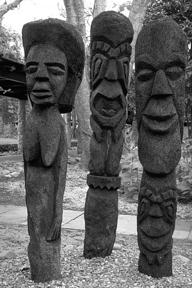

```YAML
---
useMath: true
---
```

---
useMath: true
---

Siren Deep Learning Neural Networks
===================

##### Analysis of Siren-based deep learning architectures for measuring and comparing their major performance against common alternative compression algorithms


<div class="math"> 
\begin{equation}
  F = (x, \Phi, \nabla_{x}\Phi, \nabla_{x}^{2}\Phi, \dots) = 0, \Phi:x \rightarrow \Phi(x)
\end{equation}
</div>

```
Topics: Deep Learning, Siren-based Nets, Compression Algorithms.
Author: Francesco Maria Chiarlo.
Date: 10-14-2020.
```

<!-- Start Document Outline -->

* [Introduction](#introduction)
* [First week (from 1st October 2020 to 8th October 2020)](#first-week-from-1st-october-2020-to-8th-october-2020)
* [Notebooks details](#notebooks-details)
	* [Notebook siren_test_cmd_line_tool_from_github.ipynb](#notebook-siren_test_cmd_line_tool_from_githubipynb)
	* [Notebook siren_history_train_a_posteriori_analysis.ipynb](#notebook-siren_history_train_a_posteriori_analysisipynb)
		* [History analyses](#history-analyses)
		* [Benford Law's applied to images](#benford-laws-applied-to-images)
* [Citations](#citations)

<!-- End Document Outline -->

## Introduction
The main goal of this short report is to tell about the several, different experiments that have been carried out from me during the last two expended weeks, more or less, from 1^st^ October 2020 up to 15^th^ October 2020.

-----

## First week (from 1^st^ October 2020 to 8^th^ October 2020)

The first week, that went from 1^st^ October 2020 to 8^th^ October 2020, was spent by me developing two main **Colab notebooks**, named respectively, [**siren_test_cmd_line_tool_from_github.ipynb**](https://colab.research.google.com/drive/1_fUXGPYtXPUe6xT7A2cex6Ir1bpYYIMY) and [**siren_history_train_a_posteriori_analysis.ipynb**](https://colab.research.google.com/drive/13Icvg0PkEoD2w7B0rLD_-9q_tnuaF4GM#scrollTo=pwBjltvDsPRZ). They have different objectives, which are more precisely the following:
 - the former notebook was written for allowing training a Siren-based Deep Learning model against an input image, when provided directly by the researcher or more generally by the experimenter, otherwise the default input image [**cameramen**](https://scikit-image.org/docs/0.13.x/api/skimage.data.html#skimage.data.camera) from [`skimage python module`](https://scikit-image.org/) is instead used in place of the former.
 - while the latter notebook was thought to be used later, once the training phase was done and so training results, scores, and recorded metrices are stored whitin outpout file for downstream and further investigations.

## Notebooks details
----
Here, in this section I will describe a bit into details some aspects of the notebooks cited just above, in particular, describing either the rationale behind some command line script, based on python programming language as well as pytorch deep learning framework, or some graphics plotted and used to describe insights found by analyzing a posteriori training results acquired at the end of training phase.

### Notebook [*siren_test_cmd_line_tool_from_github.ipynb*](https://colab.research.google.com/drive/1_fUXGPYtXPUe6xT7A2cex6Ir1bpYYIMY)
The first notebook, named [*siren_test_cmd_line_tool_from_github.ipynb*](https://colab.research.google.com/drive/1_fUXGPYtXPUe6xT7A2cex6Ir1bpYYIMY), contains a command line tool, that is a command line python script referred to as **main_train.py**, whose main goal is to carry out a single one shot training against user provided input image, or alternative against [**cameramen**](https://scikit-image.org/docs/0.13.x/api/skimage.data.html#skimage.data.camera) default image, in order to evaluate compression performance by means of some major metrices that are, respectively, **MSE, PSNR, and SSIM**, as well as recording training scores within a **history.txt** output file for later investigation and  furher analyses a posteriori. In particular the tool can accept some input options as shwon below by running the command followed by `--help` swith:
```	
	!python main_train.py --help
	usage: main_train.py [-h] [-c CONFIG_FILEPATH] [--evaluate] [--y] [--n] [--show_graphics] [--seed SEED] [--logging_root LOGGING_ROOT] --experiment_name EXPERIMENT_NAME [--image_filepath IMAGE_FILEPATH] [--sidelength SIDELENGTH] [--batch_size BATCH_SIZE] [--lr LR] [--num_epochs NUM_EPOCHS] [--epochs_til_ckpt EPOCHS_TIL_CKPT] [--steps_til_summary STEPS_TIL_SUMMARY] [--model_type MODEL_TYPE] [--checkpoint_path CHECKPOINT_PATH] Args that start with '--' (eg. --evaluate) can also be set in a config file (specified via -c). Config file syntax allows: key=value, flag=true, stuff=[a,b,c] (for details, see syntax at https://goo.gl/R74nmi). If an arg is specified in more than one place, then commandline values override config file values which override defaults. optional arguments: -h, --help show this help message and exit -c CONFIG_FILEPATH, --config_filepath CONFIG_FILEPATH Path to config file. --evaluate Include this option in order to evaluate model against input file. --y Include this option in order to erase content from output dir. --n Include this option in order to do not erase content from output dir. --show_graphics Include this option in order to display graphics results. --seed SEED Seed for re-running experiments (default: 0). --logging_root LOGGING_ROOT root for logging --experiment_name EXPERIMENT_NAME Name of subdirectory in logging_root where summaries and checkpoints will be saved. --image_filepath IMAGE_FILEPATH Path to input image to be compressed (default: None).If not specified, It is used cameramen image as target image to be compressed. --sidelength SIDELENGTH Sidelength to which resize input image to be compressed. --batch_size BATCH_SIZE --lr LR learning rate. default=1e-4 --num_epochs NUM_EPOCHS Number of epochs to train for. --epochs_til_ckpt EPOCHS_TIL_CKPT Time interval in seconds until checkpoint is saved. --steps_til_summary STEPS_TIL_SUMMARY Time interval in seconds until tensorboard summary is saved. --model_type MODEL_TYPE Options currently are "sine" (all sine activations), "relu" (all relu activations,"nerf" (relu activations and positional encoding as in NeRF), "rbf" (input rbf layer, rest relu),and in the future: "mixed" (first layer sine, other layers tanh)and "siren" (for Siren based neural network architectures) --checkpoint_path CHECKPOINT_PATH Checkpoint to trained model.
```
While, an example of running might be, having provided a desired input image within /content colab subdir, as follows:

		!python main_train.py --model_type "siren" \
			--y \
			--num_epochs 300 \
			--evaluate \
			--show_graphics \
			--sidelength 256 \
			--steps_til_summary 5 \
			--experiment_name "/content/outputs" \
			--image_filepath "/content/test001.png"
	
			Training on device cuda:0. # cuda device: 1 Id current device: 0 Model's state_dict: net.0.linear.weight torch.Size([256, 2]) net.0.linear.bias torch.Size([256]) net.1.linear.weight torch.Size([256, 256]) net.1.linear.bias torch.Size([256]) net.2.linear.weight torch.Size([256, 256]) net.2.linear.bias torch.Size([256]) net.3.linear.weight torch.Size([256, 256]) net.3.linear.bias torch.Size([256]) net.4.weight torch.Size([1, 256]) net.4.bias torch.Size([1]) Train on device: cuda:0 2020-10-07 20:18:14.249950: I tensorflow/stream_executor/platform/default/dso_loader.cc:48] Successfully opened dynamic library libcudart.so.10.1
			Epoch 0, Total loss 0.288646, Total PSNR 5.396346, Total SSIM -0.003688, iteration time 0.035879
			Epoch 5, Total loss 0.144552, Total PSNR 8.399751, Total SSIM 0.071265, iteration time 0.035787
			Epoch 10, Total loss 0.069640, Total PSNR 11.571429, Total SSIM 0.128144, iteration time 0.032682
			Epoch 15, Total loss 0.049948, Total PSNR 13.014845, Total SSIM 0.168483, iteration time 0.034571
			Epoch 20, Total loss 0.040432, Total PSNR 13.932714, Total SSIM 0.207593, iteration time 0.032869
			Epoch 25, Total loss 0.033744, Total PSNR 14.718014, Total SSIM 0.240798, iteration time 0.025770
			Epoch 30, Total loss 0.029000, Total PSNR 15.375977, Total SSIM 0.280443, iteration time 0.034280
			Epoch 35, Total loss 0.025833, Total PSNR 15.878237, Total SSIM 0.313670, iteration time 0.036292
			Epoch 40, Total loss 0.023582, Total PSNR 16.274124, Total SSIM 0.342565, iteration time 0.034424
			
			....
			
			Evaluate on device:  cuda:0
			Siren(
			    (net): Sequential(
			        (0): SineLayer(
			            (linear): Linear(in_features=2, out_features=256, bias=True)
			            )
			        (1): SineLayer(
			            (linear): Linear(in_features=256, out_features=256, bias=True)
			            )
			        (2): SineLayer(
			            (linear): Linear(in_features=256, out_features=256, bias=True)
			            )
			        (3): SineLayer(
			            (linear): Linear(in_features=256, out_features=256, bias=True)
			            )
			        (4): Linear(in_features=256, out_features=1, bias=True)
			        )
            )

### Notebook [*siren_history_train_a_posteriori_analysis.ipynb*](https://colab.research.google.com/drive/13Icvg0PkEoD2w7B0rLD_-9q_tnuaF4GM#scrollTo=pwBjltvDsPRZ)
Instead the subsequent colab notebook, that is called [**siren_history_train_a_posteriori_analysis.ipynb**](https://colab.research.google.com/drive/13Icvg0PkEoD2w7B0rLD_-9q_tnuaF4GM#scrollTo=pwBjltvDsPRZ), can be used for exploring both the output file **history.txt** generated by the previous colab notebook, as well as, looking at how the trained neural network processes an input image generating a new output image when the net is set into `eval` mode, for inference, more precisely compression, reasons.

#### Images
----
|Ground Thruth   |  Predicted  |
:---------------:|:-----------:|
 | |

|Predicted Grayscale |  Predicted w/ Metrices |
|:------------------:|:----------------------:|
|  |  |

#### History analyses
----
Moreover, exploiting the content of **history.txt** which is as follows:

		history_df.head(5)

| Epoch | train_loss(MSE) | train_psnr (db) | train_ssim |
| ----- | --------------- | --------------- | ---------- |
| 0     | 0.288646        | 5.396346        | -0.003688  |
| 1     | 0.214251        | 6.690774        | 0.034964   |
| 2     | 0.199153        | 7.008121        | 0.049086   |
| 3     | 0.184765        | 7.333792        | 0.055266   |
| 4     | 0.164772        | 7.831174        | 0.061327   |

allows me to create and discuss some further graphics which are the following:


The panel above show us how the **MSE, PSNR(DB), and SSIM** vary while the training phase was carryed out reminding us that the training step was done using specific hyper-parameters to lead the process of fitting a model against the input image, attempting at the same time to overfit as much as possible for reaching a better implici representation. In particular, we can observe that after a total of 300 epochsm, throught which the model runs in order to be fitted, the final scores we can observe from the graphics tell us that:

- **Loss score(MSE)** - shown in yellow, decreases quickly at the very beginning so that the model makes as close as possible input data mapped into output target, reaching a final value lower than $$7e-3$$.
- **PSNR(db)** -  shown in red, increases in a logarithm fanshion without yet saturating up to $$21.55(db)$$.
- Lastly, **SSIM** - shown in red, as the PSNR score, follows a logarithm trend but with less strength and does not saturate, but reaches a somewhat high value equals to $$0.774$$.

So, there is still room for improving trainign performances, and maybe 300 epochs might not be enough.
  
#### Benford Law's applied to images
----
A set of numbers is said to satisfy Benford's law if the leading digit $$d (d\in {1, \dots, 9})$$ occurs with probability:

<div class="math"> 
\begin{equation}
  P(d) = \log_{10}(d+1) - \log_{10}(d) = \log_{10}(\frac{d+1}{d}) = \log_{10}(1 + \frac{1}{d})
\end{equation}
</div>

The leading digits in such a set thus have the following distribution:


| Digit | P(digit) |
| ----- | -------- |
|  1    | 30.1%    |
|  2    | 17.6%    |
|  3    | 12.5%    |
|  4    |  9.7%    |
|  5    |  7.9%    |
|  6    |  6.7%    |
|  7    |  5.8%    |
|  8    |  5.1%    |
|  9    | 4.6%     |


Looking at the images reported just above, which have been made combining leading digit distributions respectively from the Benford's Law, used as main reference, the original image, used as the input processed by the network, and the result outputed by the network, as it is and converting the output to a grayscale image in nature, we can say what follows:

- In both images the distribution of the original input image, in the graph referred to as **Ground Thruth**, seems to depart from the Beford's law slightly at *leadign digit 1* as well as for others leading digits such as *5,6, and 7*. While seems to be more or less similar in proportion to other remianing leading digits.
- While the output result, so the predicted image, from the one ingested by the model, referred to as simply **Predicted**, shows us that the model drammatically and importantly changes leading digit distribution meanly for *leading digit 2*. Whereas, in general, the other remanining digits have experienced a huge drop in their probabilities of occurring. In particular, *leading digits from 3 up to 6* as well as *1* seem to experience the worst decreasing in their probabilities of occuring.

Finally, the model trained onto that specific image, which a particular hyper-parameter setting shown us that the effect on the input was of shifting the probability of occurring mostly on leading digit 2, that corresponds to making more likely those values either within $$[20, 30) \cup [200, 255]$$.


 

## Citations

```
@inproceedings{sitzmann2019siren,
    author = {Sitzmann, Vincent
              and Martel, Julien N.P.
              and Bergman, Alexander W.
              and Lindell, David B.
              and Wetzstein, Gordon},
    title = {Implicit Neural Representations
              with Periodic Activation Functions},
    booktitle = {arXiv},
    year={2020}
}
```

```
Stéfan van der Walt, Johannes L. Schönberger, Juan Nunez-Iglesias, François Boulogne, Joshua D. Warner, Neil Yager, Emmanuelle Gouillart, Tony Yu, and the scikit-image contributors. scikit-image: Image processing in Python. PeerJ 2:e453 (2014) https://doi.org/10.7717/peerj.453
```